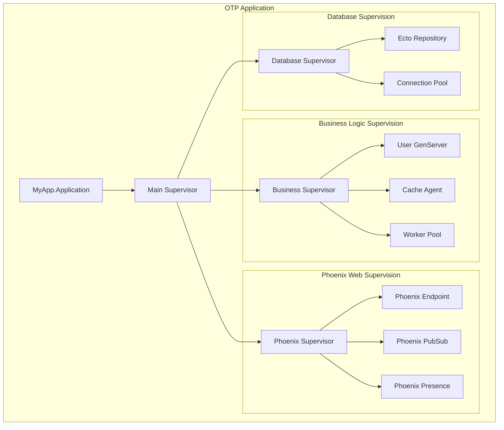
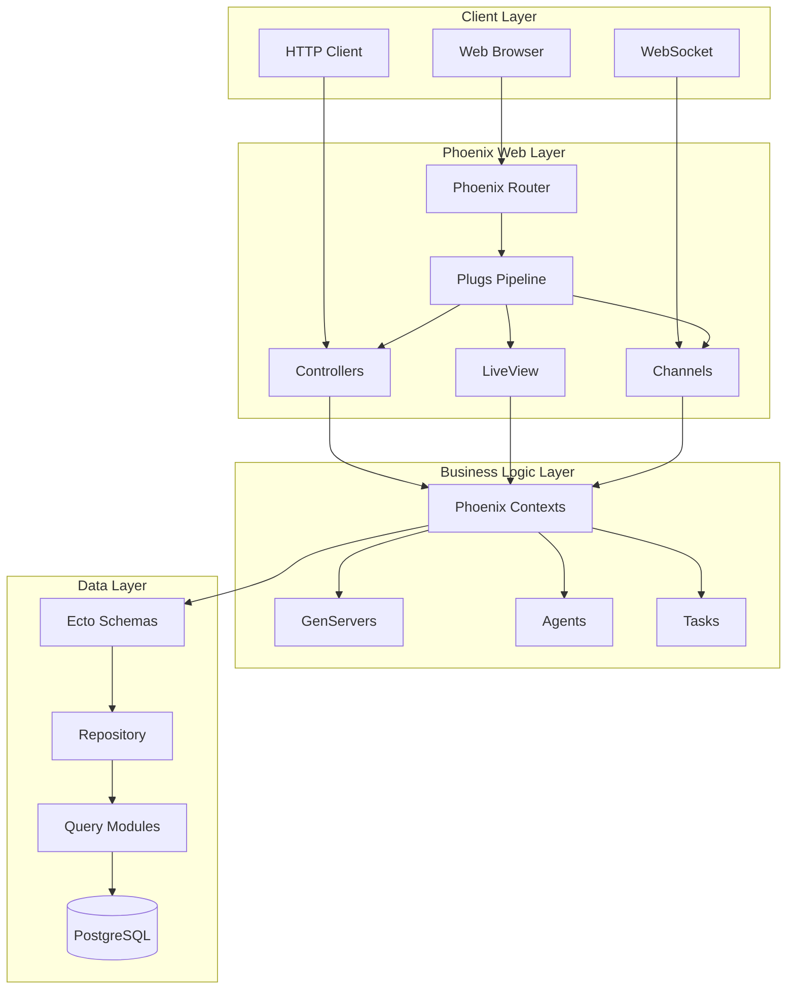

# Create Elixir Project Planning Document

## Focus Area: $ARGUMENTS

Generate a comprehensive PLANNING.md specifically designed for Elixir/Phoenix development, emphasizing OTP design patterns, supervision trees, fault tolerance, and concurrent processing architecture.

## Prerequisites
Ensure you have completed:
1. `/create-prd` - For Elixir project requirements and OTP patterns
2. `/create-claude-md` - For Elixir development context and conventions

## Elixir Planning Analysis
- Extract OTP architecture decisions from PRD.md
- Analyze supervision tree requirements and process design
- Review Phoenix framework patterns and LiveView usage
- Identify concurrent processing needs and GenServer patterns
- Assess database patterns with Ecto and PostgreSQL

## PLANNING.md Template for Elixir Projects

Generate a comprehensive planning document following this Elixir-optimized structure:

```markdown
# Elixir Project Planning Document: [Project Name]

## Vision & Mission

### Project Vision
[High-level vision emphasizing Elixir's concurrent and fault-tolerant nature]

### Mission Statement
[What we're solving with Elixir's unique capabilities - Actor model, "let it crash" philosophy]

### Success Definition
[Specific, measurable outcomes leveraging Elixir strengths]
- **Concurrency Success**: Handle [X] concurrent users/processes
- **Fault Tolerance**: 99.9% uptime with graceful error recovery
- **Performance**: Sub-100ms response times under load
- **Scalability**: Linear scaling with additional nodes

## Strategic Objectives

### Primary Goals
1. **Concurrent Processing**: Leverage Actor model for [specific use case]
2. **Fault Tolerance**: Implement supervision trees for reliability
3. **Real-time Features**: Use Phoenix LiveView/Channels for [features]
4. **Scalability**: Design for distributed deployment

### Secondary Goals
- Hot code upgrades for zero-downtime deployment
- Integration with external services using fault-tolerant patterns
- Performance optimization using Elixir's strengths

## Technical Architecture

### OTP Application Structure


### Phoenix Web Architecture


### Architecture Decisions

#### 1. OTP Design Patterns Selection
**Supervision Strategy:**
- **Main Supervisor**: `:one_for_one` strategy for independent subsystems
- **Business Logic**: `:one_for_all` for interdependent processes
- **Worker Pools**: `:simple_one_for_one` for dynamic worker creation

**Process Architecture:**
- **GenServer**: User sessions, caches, stateful business logic
- **Agent**: Simple state management for configuration
- **Task**: Asynchronous operations and parallel processing
- **Registry**: Process discovery and pub/sub patterns

#### 2. Phoenix Framework Integration
**Web Layer Patterns:**
- **Phoenix Contexts**: Business logic boundaries following DDD
- **LiveView**: Real-time UI components for [specific features]
- **Channels**: WebSocket communication for [real-time requirements]
- **Plugs**: Request/response transformation pipeline

**Real-time Architecture:**
- **Phoenix PubSub**: Event broadcasting across processes
- **Phoenix Presence**: User presence tracking
- **LiveView**: Server-side rendering with minimal JavaScript

#### 3. Database and State Management
**Ecto Patterns:**
- **Schemas**: Data structures with validations and associations
- **Changesets**: Data validation and transformation
- **Queries**: Composable query building and optimization
- **Transactions**: Multi-step operations with rollback

**State Management Strategy:**
- **GenServer**: Long-lived process state
- **Agent**: Simple shared state
- **ETS**: High-performance in-memory storage
- **Database**: Persistent state with Ecto

### Fault Tolerance Design

#### Supervision Tree Strategy
```elixir
defmodule MyApp.Application do
  use Application
  
  def start(_type, _args) do
    children = [
      # Database
      MyApp.Repo,
      
      # Business Logic Supervisors
      {MyApp.BusinessSupervisor, []},
      
      # Phoenix Web
      MyAppWeb.Endpoint,
      MyAppWeb.Presence,
      
      # Background Jobs
      {MyApp.WorkerSupervisor, []}
    ]
    
    opts = [strategy: :one_for_one, name: MyApp.Supervisor]
    Supervisor.start_link(children, opts)
  end
end
```

#### Error Handling Strategy
- **Let it crash**: Allow processes to fail and restart
- **Circuit breakers**: Protect against cascading failures
- **Timeouts**: Prevent hanging processes
- **Graceful degradation**: Partial functionality during failures

### Data Architecture

#### Ecto Schema Design
```elixir
defmodule MyApp.Accounts.User do
  use Ecto.Schema
  import Ecto.Changeset
  
  schema "users" do
    field :email, :string
    field :name, :string
    field :active, :boolean, default: true
    
    has_many :posts, MyApp.Content.Post
    
    timestamps()
  end
  
  def changeset(user, attrs) do
    user
    |> cast(attrs, [:email, :name, :active])
    |> validate_required([:email, :name])
    |> validate_format(:email, ~r/@/)
    |> unique_constraint(:email)
  end
end
```

#### Database Migration Strategy
- **Incremental migrations**: Small, reversible database changes
- **Zero-downtime**: Migrations that don't lock tables
- **Data integrity**: Proper constraints and validations
- **Performance**: Indexes and query optimization

### Performance Architecture

#### Concurrency Optimization
- **Process pooling**: Connection pools and worker pools
- **Load balancing**: Distribute work across processes
- **Backpressure**: Handle system overload gracefully
- **Monitoring**: Track process performance and bottlenecks

#### Caching Strategy
```elixir
# ETS-based caching
defmodule MyApp.Cache do
  use Agent
  
  def start_link(initial_value) do
    Agent.start_link(fn -> initial_value end, name: __MODULE__)
  end
  
  def get(key) do
    Agent.get(__MODULE__, fn state -> Map.get(state, key) end)
  end
  
  def put(key, value) do
    Agent.update(__MODULE__, fn state -> Map.put(state, key, value) end)
  end
end
```

## Implementation Strategy

### Development Phases

#### Phase 1: OTP Foundation (Weeks 1-2)
**Objectives**: Establish core OTP architecture and supervision tree

**Deliverables:**
- [ ] OTP Application setup with proper supervision tree
- [ ] Core GenServers and Agents implemented
- [ ] Database connection with Ecto repository
- [ ] Basic Phoenix endpoint configuration
- [ ] Telemetry and logging setup

**Success Criteria:**
- Supervision tree starts and supervises properly
- All processes can be started and restarted
- Database connections are pooled and managed
- Basic health checks pass

#### Phase 2: Phoenix Web Layer (Weeks 3-4)
**Objectives**: Implement Phoenix web framework patterns

**Deliverables:**
- [ ] Phoenix contexts for business logic
- [ ] Controllers and routing setup
- [ ] LiveView components (if applicable)
- [ ] WebSocket channels (if applicable)
- [ ] Authentication and authorization

**Success Criteria:**
- All web endpoints respond correctly
- Real-time features work properly
- Authentication flows complete
- Context boundaries are respected

#### Phase 3: Core Business Logic (Weeks 5-8)
**Objectives**: Implement main application features

**Deliverables:**
- [ ] Business logic GenServers and processes
- [ ] Database schemas and migrations
- [ ] External service integrations
- [ ] Background job processing
- [ ] Comprehensive testing

**Success Criteria:**
- All business workflows complete successfully
- Fault tolerance handles edge cases
- Performance targets are met
- Integration tests pass

#### Phase 4: Production Readiness (Weeks 9-10)
**Objectives**: Prepare for production deployment

**Deliverables:**
- [ ] Production configuration and releases
- [ ] Monitoring and observability
- [ ] Load testing and optimization
- [ ] Documentation and deployment guides
- [ ] Security hardening

**Success Criteria:**
- Application handles production load
- Monitoring provides adequate visibility
- Deployment process is automated
- Security audit passes

### Risk Management

#### Technical Risks
| Risk | Probability | Impact | Mitigation Strategy |
|------|------------|--------|-------------------|
| Process bottlenecks | Medium | High | Proper process design, load testing |
| Database connection exhaustion | Medium | High | Connection pooling, query optimization |
| Memory leaks in processes | Low | High | Proper state management, monitoring |
| Supervision tree complexity | Medium | Medium | Clear supervision strategy, testing |

#### OTP-Specific Risks
| Risk | Probability | Impact | Mitigation Strategy |
|------|------------|--------|-------------------|
| Cascading failures | Low | High | Proper isolation, circuit breakers |
| Hot code upgrade issues | Low | Medium | Thorough testing, rollback procedures |
| Process registry conflicts | Low | Medium | Proper naming conventions, coordination |

## Required Tools & Technologies

### Core Elixir Stack
```bash
# Language and Runtime
Elixir 1.15+
Erlang/OTP 26+

# Web Framework
Phoenix 1.7+
Phoenix LiveView 0.20+
Phoenix PubSub 2.1+

# Database
PostgreSQL 14+
Ecto 3.10+
Postgrex 0.17+

# JSON and HTTP
Jason 1.4+
Tesla 1.7+ (for external APIs)
```

### Development Tools
```bash
# Code Quality
Credo 1.7+          # Static analysis
Dialyxir 1.4+       # Type checking
ExCoveralls 0.17+   # Test coverage

# Documentation
ExDoc 0.30+         # Documentation generation

# Testing
StreamData 0.6+     # Property-based testing
Bypass 2.1+         # HTTP mocking
```

### Production Infrastructure
```bash
# Deployment
Docker              # Containerization
Kubernetes         # Orchestration
Prometheus         # Monitoring
Grafana            # Dashboards

# External Services
Redis              # Caching
RabbitMQ           # Message queuing
PostgreSQL         # Primary database
```

## Quality Assurance Plan

### Testing Strategy
```mermaid
pyramid TD
    A[Unit Tests - ExUnit<br/>70-80% Coverage]
    B[Integration Tests<br/>15-20% Coverage]
    C[Property Tests - StreamData<br/>5-10% Coverage]
    D[End-to-End Tests<br/>5% Coverage]
    
    A --> B
    B --> C
    C --> D
```

#### Elixir-Specific Testing
- **Unit Tests**: Individual function and module testing
- **GenServer Tests**: Process state and message handling
- **Context Tests**: Business logic boundary testing
- **LiveView Tests**: Real-time UI component testing
- **Channel Tests**: WebSocket communication testing

### Code Quality Standards
- **Credo compliance**: No warnings or errors
- **Dialyzer success**: Type checking passes
- **Test coverage**: 90%+ for critical paths
- **Documentation**: @doc and @spec for all public functions

### Performance Requirements

#### Elixir-Specific Targets
- **Process spawn time**: < 1ms per process
- **Message passing**: < 1ms between processes
- **GenServer response**: < 5ms for state operations
- **Database queries**: < 10ms for simple operations
- **LiveView updates**: < 50ms for UI changes

#### Scalability Targets
- **Concurrent processes**: 1M+ lightweight processes
- **Concurrent users**: 10K+ WebSocket connections
- **Database connections**: Efficient pooling (10-20 connections)
- **Memory usage**: < 100MB base application memory

### Deployment Pipeline


## Monitoring & Observability

### Telemetry Events
```elixir
# Custom telemetry events
:telemetry.execute([:my_app, :business_logic, :process_started], %{count: 1})
:telemetry.execute([:my_app, :database, :query_executed], %{duration: 50})
```

### Key Metrics
- **Process metrics**: Count, memory usage, message queue length
- **Database metrics**: Query time, connection pool usage
- **Phoenix metrics**: Request/response times, LiveView connections
- **Business metrics**: Feature usage, error rates

### Alerting Strategy
- **Process failures**: Supervisor restart notifications
- **Performance degradation**: Response time alerts
- **Resource exhaustion**: Memory and CPU alerts
- **Database issues**: Connection pool and query alerts

---

*This planning document provides the architectural blueprint for implementing Elixir/Phoenix applications using OTP design principles, supervision trees, and fault-tolerant patterns.*
```

## Focus Area Customizations

### OTP Supervision Tree Focus
```markdown
### Detailed Supervision Strategy
- Process lifecycle management
- Restart strategies and backoff
- Child specification patterns
- Dynamic supervision for scalability

### Process Communication Patterns
- Message passing protocols
- PubSub event broadcasting
- Registry-based discovery
- Cross-node communication
```

### Phoenix LiveView Architecture Focus
```markdown
### LiveView Component Design
- Server-side rendering patterns
- State management strategies
- Event handling and updates
- Component composition

### Real-time Features
- WebSocket channel patterns
- Presence tracking implementation
- PubSub event distribution
- Optimistic UI updates
```

### Distributed System Focus
```markdown
### Node Distribution
- Multi-node deployment strategy
- Process distribution patterns
- Fault tolerance across nodes
- Load balancing strategies

### Clustering and Service Discovery
- Node connection management
- Service registration patterns
- Health checking and monitoring
- Graceful shutdown procedures
```

## Output and Validation

### Save Location
Save the generated planning document as: `PLANNING.md` in the project root

### Elixir-Specific Quality Checklist
- [ ] OTP architecture comprehensively designed
- [ ] Supervision tree strategy clearly defined
- [ ] Phoenix framework patterns properly planned
- [ ] Process communication patterns specified
- [ ] Database schema design follows Ecto best practices
- [ ] Fault tolerance and error handling strategies defined
- [ ] Performance targets include concurrency metrics
- [ ] Testing strategy covers GenServer and LiveView patterns
- [ ] Deployment uses Mix releases and OTP principles
- [ ] Monitoring includes process and system metrics

### Next Steps
After PLANNING.md creation:
1. Review OTP architecture with Elixir experts
2. Validate supervision tree design
3. Use `/create-tasks` to break down into Elixir-specific tasks
4. Begin development with OTP foundation

Remember: This plan leverages Elixir's unique strengths - massive concurrency, fault tolerance, and the Actor model - while following OTP design principles and Phoenix framework best practices.