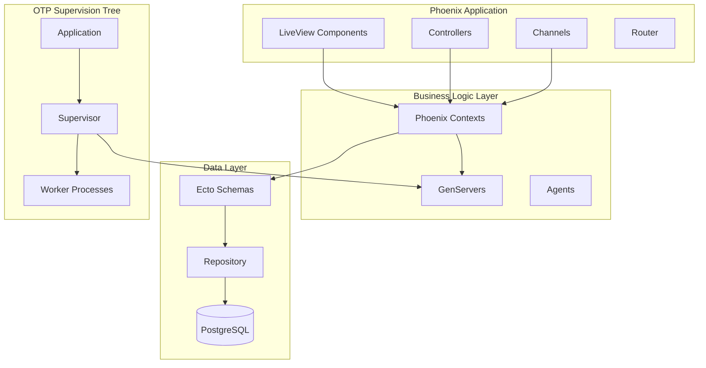

# Create Elixir Product Requirements Document

## Project: $ARGUMENTS

Generate a comprehensive PRD specifically tailored for Elixir/Phoenix development, incorporating OTP design patterns, fault tolerance, and concurrent processing best practices.

## Research & Discovery Process

### 1. **Elixir/Phoenix Ecosystem Analysis**
- **Application Type**: Web app (Phoenix), API, OTP application, umbrella project
- **Concurrency Requirements**: Identify processes, GenServers, supervision needs
- **Real-time Features**: Phoenix Channels, LiveView, PubSub requirements
- **Database Patterns**: Ecto schemas, migrations, multi-tenancy needs
- **Integration Points**: External APIs, message queues, third-party services

### 2. **OTP Architecture Research**
- **Process Architecture**: Actor model implementation, message passing patterns
- **Supervision Strategy**: One-for-one, one-for-all, rest-for-one patterns
- **Fault Tolerance**: "Let it crash" philosophy, error recovery strategies
- **State Management**: GenServer, Agent, ETS, persistent_term usage
- **Scalability**: Distributed Erlang, clustering, load balancing

### 3. **Phoenix Framework Considerations**
- **LiveView vs. Traditional**: Real-time UI requirements
- **Context Boundaries**: Business logic separation patterns
- **Channel Architecture**: WebSocket connections, presence tracking
- **Performance**: Caching strategies, database optimization
- **Testing**: ExUnit patterns, integration testing approaches

## PRD Generation Framework

Create a comprehensive PRD following this Elixir-optimized structure:

### PRD Template Structure
```markdown
# Product Requirements Document: [Project Name]

## 1. Executive Summary
- **Problem Statement**: What problem does this Elixir application solve?
- **Solution Overview**: High-level description leveraging Elixir's strengths
- **Success Criteria**: Measurable outcomes including performance/concurrency metrics
- **Resource Requirements**: Team, timeline, infrastructure needs

## 2. Elixir/Phoenix Architecture Overview

### Application Type
- **Framework**: Phoenix Web Application | Pure OTP Application | Umbrella Project
- **Concurrency Model**: Actor-based processes, message passing patterns
- **Supervision Strategy**: Fault tolerance and recovery mechanisms
- **Database**: PostgreSQL with Ecto, potential for distributed data

### System Architecture


## 3. Functional Requirements

### Core Features
- **Feature 1**: [Description with Elixir implementation approach]
  - **Processes**: Which GenServers/Agents will manage this feature
  - **Supervision**: How this feature fits in the supervision tree
  - **Concurrency**: How multiple users/requests are handled
  - **Error Handling**: Fault tolerance and recovery strategies

### User Experience Requirements
- **Real-time Features**: LiveView components, Channel subscriptions
- **Performance**: Response time targets, concurrent user capacity
- **Responsiveness**: UI state management, optimistic updates
- **Offline Capability**: Handling disconnections, state synchronization

### API Specifications
- **REST Endpoints**: Traditional HTTP API patterns
- **WebSocket Channels**: Real-time communication patterns
- **GraphQL**: If applicable, with Absinthe integration
- **Authentication**: Guardian JWT, session management

## 4. Technical Architecture

### OTP Design Patterns
- **Application Structure**: Supervision tree design
- **Process Communication**: Message passing, PubSub patterns
- **State Management**: GenServer vs Agent vs ETS usage
- **Error Handling**: "Let it crash" implementation
- **Hot Code Upgrades**: Release management strategy

### Database Design
- **Ecto Schemas**: Entity definitions and relationships
- **Migrations**: Database evolution strategy
- **Queries**: Ecto query patterns and optimization
- **Transactions**: Multi-step operation handling
- **Constraints**: Database-level data integrity

### Phoenix Contexts
- **Boundary Definition**: Business logic separation
- **Context APIs**: Public function interfaces
- **Cross-Context Communication**: Message passing patterns
- **Testing**: Context isolation and mocking

## 5. Performance & Scalability

### Concurrency Targets
- **Concurrent Users**: Target simultaneous connections
- **Process Limits**: Maximum supervised processes
- **Memory Usage**: Per-process and total memory targets
- **Response Times**: 95th percentile response time goals

### Scaling Strategy
- **Horizontal Scaling**: Multi-node deployment
- **Load Balancing**: Distribution strategy
- **Database Scaling**: Read replicas, connection pooling
- **Caching**: ETS, Redis, application-level caching

## 6. Security & Reliability

### Security Implementation
- **Authentication**: Guardian, session management
- **Authorization**: Role-based access control
- **Input Validation**: Ecto changesets, custom validators
- **CSRF Protection**: Phoenix built-in protections
- **Rate Limiting**: Process-based rate limiting

### Fault Tolerance
- **Supervision Strategy**: How failures are handled
- **Circuit Breakers**: External service failure protection
- **Graceful Degradation**: Partial failure handling
- **Monitoring**: Telemetry, health checks, alerting

## 7. Testing Strategy

### Test Types
- **Unit Tests**: ExUnit for individual functions
- **Integration Tests**: Context and API testing
- **Property Tests**: StreamData for edge cases
- **LiveView Tests**: Phoenix LiveView test helpers
- **Performance Tests**: Load testing with :observer

### Test Structure
```elixir
# Example test structure
defmodule MyApp.AccountsTest do
  use MyApp.DataCase
  
  alias MyApp.Accounts
  
  describe "users" do
    test "create_user/1 with valid data creates a user" do
      # Test implementation
    end
  end
end
```

## 8. Development & Deployment

### Development Environment
- **Elixir Version**: 1.15+ recommended
- **Erlang/OTP**: 26+ recommended
- **Database**: PostgreSQL development setup
- **Tools**: Mix, ExUnit, Credo, Dialyzer

### Code Quality
- **Credo**: Static code analysis
- **Dialyzer**: Type checking and analysis
- **ExCoveralls**: Test coverage reporting
- **ExDoc**: Documentation generation

### Deployment Strategy
- **Releases**: Mix releases for production
- **Clustering**: Multi-node deployment setup
- **Database Migrations**: Production migration strategy
- **Monitoring**: Telemetry, logging, health checks

## 9. Integration Requirements

### External Services
- **APIs**: HTTP client patterns with Tesla/HTTPoison
- **Message Queues**: RabbitMQ, Apache Kafka integration
- **Caching**: Redis integration patterns
- **File Storage**: S3, local filesystem handling

### Third-party Libraries
- **Phoenix Framework**: Latest stable version
- **Ecto**: Database wrapper and query builder
- **Guardian**: Authentication and authorization
- **Tesla**: HTTP client for external APIs
- **Broadway**: Data processing pipelines

## 10. Success Metrics

### Performance Metrics
- **Response Time**: 95th percentile under 100ms
- **Throughput**: Requests per second targets
- **Concurrent Users**: Simultaneous connection capacity
- **Memory Usage**: Per-process and total memory efficiency
- **CPU Usage**: Optimal core utilization

### Business Metrics
- **User Adoption**: Registration and engagement rates
- **Feature Usage**: Core feature utilization
- **Error Rates**: Application stability metrics
- **Uptime**: Availability and reliability targets

## 11. Risk Assessment

### Technical Risks
| Risk | Probability | Impact | Mitigation Strategy |
|------|------------|--------|-------------------|
| Process Bottlenecks | Medium | High | Proper supervision tree design, load testing |
| Database Performance | Medium | High | Connection pooling, query optimization |
| Memory Leaks | Low | High | Proper process lifecycle management |
| Third-party Dependencies | Medium | Medium | Fallback strategies, circuit breakers |

### OTP-Specific Considerations
- **Process Explosion**: Uncontrolled process creation
- **Supervision Complexity**: Overly complex supervision trees
- **Message Queue Buildup**: Slow message processing
- **Hot Code Upgrade Issues**: State migration problems

## 12. Implementation Timeline

### Phase 1: Foundation (Weeks 1-2)
- Phoenix application setup
- Database schema design
- Basic supervision tree
- Authentication system

### Phase 2: Core Features (Weeks 3-6)
- Business logic implementation
- LiveView components
- API endpoints
- Testing framework

### Phase 3: Advanced Features (Weeks 7-10)
- Real-time features
- Performance optimization
- Integration testing
- Monitoring setup

### Phase 4: Production Ready (Weeks 11-12)
- Security hardening
- Performance tuning
- Deployment pipeline
- Documentation completion

---

*This PRD leverages Elixir's strengths in concurrency, fault tolerance, and real-time applications while following OTP design principles and Phoenix framework best practices.*
```

## Elixir-Specific Considerations

### OTP Design Patterns
- **GenServer**: Long-running processes with state
- **Agent**: Simple state management
- **Task**: Asynchronous operations
- **Supervisor**: Fault tolerance and recovery
- **Application**: Top-level application behavior

### Phoenix Patterns
- **Contexts**: Business logic boundaries
- **LiveView**: Real-time UI components
- **Channels**: WebSocket communication
- **Plugs**: Request/response transformation
- **Ecto**: Database operations and validation

### Performance Optimization
- **Process Pooling**: Connection and worker pools
- **ETS Tables**: In-memory caching
- **Telemetry**: Performance monitoring
- **Profiling**: Memory and CPU analysis

## Output and Validation

### Save Location
Save the completed PRD as: `PRD.md` in the project root

### Elixir-Specific Quality Checklist
- [ ] OTP design patterns properly specified
- [ ] Supervision tree architecture defined
- [ ] Concurrency model clearly described
- [ ] Phoenix contexts and boundaries planned
- [ ] Database design follows Ecto best practices
- [ ] Testing strategy includes ExUnit patterns
- [ ] Performance targets include concurrency metrics
- [ ] Security considerations for Phoenix applications
- [ ] Deployment strategy uses Mix releases
- [ ] Integration patterns for external services defined

### Next Steps
After PRD completion:
1. Review OTP architecture with Elixir experts
2. Use `/create-claude-md` with "Elixir Phoenix" tech stack
3. Continue with `/create-planning` for detailed implementation
4. Finish with `/create-tasks` for Elixir-specific task breakdown

Remember: This PRD should leverage Elixir's unique strengths - the Actor model, fault tolerance, and massive concurrency capabilities.