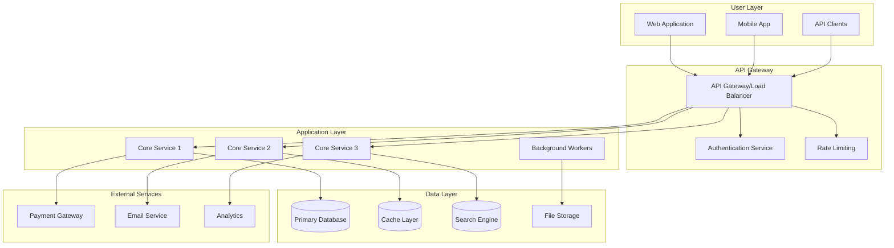
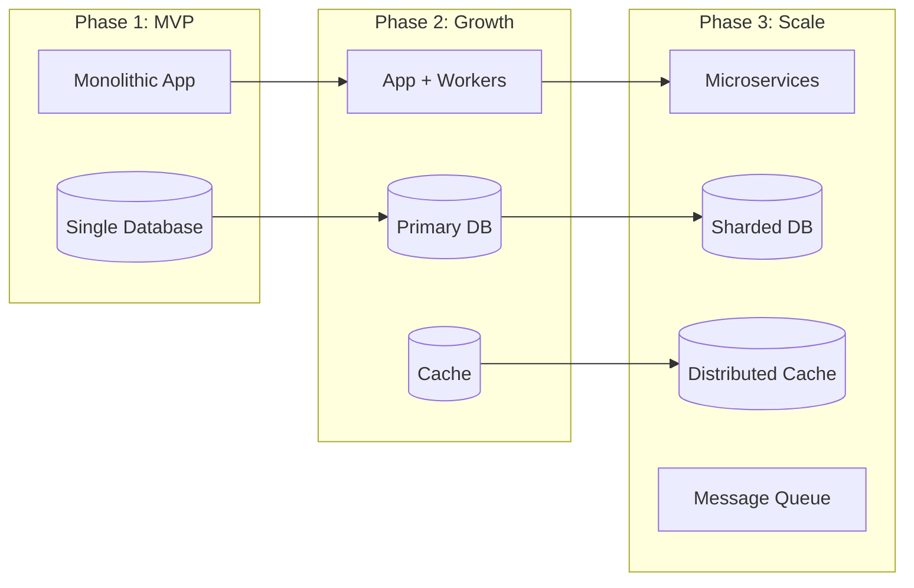
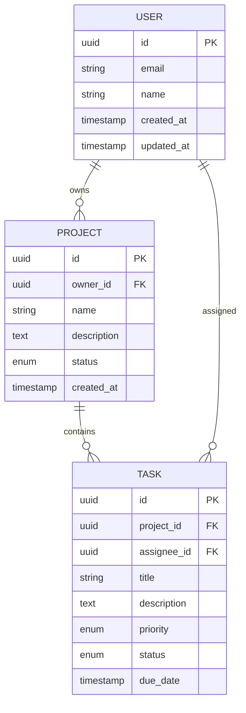
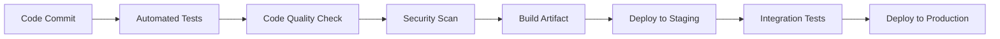

# Create Project Planning Document

## Focus Area: $ARGUMENTS

Generate a comprehensive PLANNING.md that bridges the gap between your PRD vision and implementation reality. This document provides the architectural blueprint and strategic planning needed for successful development.

## Prerequisites
Ensure you have completed:
1. `/create-prd` - For project requirements and scope
2. `/create-claude-md` - For development context and tech stack

## Planning Document Generation

### 1. Context Analysis
- Extract vision and objectives from PRD.md
- Analyze technical requirements and constraints
- Review chosen tech stack from CLAUDE.md
- Identify integration points and dependencies

### 2. Architecture Deep Dive
- Design system architecture based on PRD specifications
- Define component interactions and data flow
- Plan scalability and performance optimizations
- Address security and compliance requirements

### 3. Implementation Strategy
- Break down development into logical phases
- Identify critical path and dependencies
- Plan testing and validation approaches
- Define deployment and DevOps strategy

## PLANNING.md Template Structure

Generate a comprehensive planning document following this structure:

```markdown
# Project Planning Document: [Project Name]

## Vision & Mission

### Project Vision
[High-level vision from PRD - the future state we're building toward]

### Mission Statement
[What we're solving and for whom - distilled from PRD problem statement]

### Success Definition
[Specific, measurable outcomes that define project success]
- Business Success: [Revenue, users, market impact]
- Technical Success: [Performance, reliability, scalability]
- User Success: [Adoption, satisfaction, value delivered]

## Strategic Objectives

### Primary Goals
1. **[Goal 1]**: [Description and success metrics]
2. **[Goal 2]**: [Description and success metrics]
3. **[Goal 3]**: [Description and success metrics]

### Secondary Goals
- [Supporting objectives that enhance primary goals]
- [Nice-to-have features that add value]
- [Long-term expansion opportunities]

## Technical Architecture

### System Overview


### Architecture Decisions

#### 1. Technology Stack Selection
**Frontend:**
- **Primary**: [Framework/Library] ([Version])
- **Reasoning**: [Why this choice fits project needs]
- **Alternatives Considered**: [Other options and why rejected]

**Backend:**
- **Primary**: [Framework/Language] ([Version])
- **Reasoning**: [Performance, scalability, team expertise considerations]
- **Alternatives Considered**: [Other options and trade-offs]

**Database:**
- **Primary**: [Database Type] ([Version])
- **Reasoning**: [Data structure, scaling, consistency requirements]
- **Caching**: [Cache solution and strategy]

**Infrastructure:**
- **Hosting**: [Cloud provider or hosting solution]
- **Deployment**: [Container orchestration, CI/CD pipeline]
- **Monitoring**: [Observability and monitoring stack]

#### 2. Architectural Patterns
- **Design Pattern**: [MVC, Microservices, Event-driven, etc.]
- **Data Access**: [ORM, Repository pattern, etc.]
- **Communication**: [REST, GraphQL, gRPC, messaging]
- **State Management**: [How application state is managed]

#### 3. Scalability Strategy


### Data Architecture

#### Database Design


#### Data Flow Strategy
1. **Input Validation**: [How data is validated on entry]
2. **Processing Pipeline**: [How data flows through the system]
3. **Storage Strategy**: [How data is stored and organized]
4. **Caching Strategy**: [What data is cached and when]
5. **Backup & Recovery**: [Data protection and disaster recovery]

### Security Architecture

#### Authentication & Authorization
- **Authentication Method**: [JWT, OAuth, Sessions, etc.]
- **Authorization Model**: [RBAC, ABAC, etc.]
- **Session Management**: [How user sessions are handled]
- **API Security**: [Rate limiting, API keys, etc.]

#### Data Protection
- **Encryption**: [At rest and in transit encryption]
- **PII Handling**: [Personal data protection strategy]
- **Audit Logging**: [Security event logging and monitoring]
- **Compliance**: [GDPR, HIPAA, SOC2, etc. requirements]

## Implementation Strategy

### Development Phases

#### Phase 1: Foundation (Weeks 1-4)
**Objectives**: Establish core infrastructure and basic functionality

**Deliverables:**
- [ ] Development environment setup
- [ ] CI/CD pipeline configuration
- [ ] Database schema implementation
- [ ] Authentication system
- [ ] Basic API structure
- [ ] Frontend application shell

**Success Criteria:**
- All developers can run the project locally
- Basic user registration and login works
- Core API endpoints respond correctly
- Automated tests run successfully

#### Phase 2: Core Features (Weeks 5-10)
**Objectives**: Implement primary user-facing features

**Deliverables:**
- [ ] [Core Feature 1] - [Description]
- [ ] [Core Feature 2] - [Description]
- [ ] [Core Feature 3] - [Description]
- [ ] User interface for core workflows
- [ ] Data validation and error handling
- [ ] Basic admin functionality

**Success Criteria:**
- Users can complete primary workflows
- Data integrity is maintained
- Performance meets basic requirements
- Security measures are in place

#### Phase 3: Enhancement (Weeks 11-14)
**Objectives**: Add advanced features and optimizations

**Deliverables:**
- [ ] [Advanced Feature 1] - [Description]
- [ ] [Advanced Feature 2] - [Description]
- [ ] Performance optimizations
- [ ] Advanced user interface components
- [ ] Integration with external services
- [ ] Comprehensive testing

**Success Criteria:**
- All planned features are functional
- Performance targets are met
- User experience is polished
- System is production-ready

#### Phase 4: Launch Preparation (Weeks 15-16)
**Objectives**: Prepare for production deployment

**Deliverables:**
- [ ] Production environment setup
- [ ] Security audit and penetration testing
- [ ] Load testing and performance validation
- [ ] Documentation completion
- [ ] User acceptance testing
- [ ] Launch plan execution

**Success Criteria:**
- System passes all security requirements
- Performance under load is acceptable
- All documentation is complete
- Launch plan is validated

### Risk Management

#### Technical Risks
| Risk | Probability | Impact | Mitigation Strategy |
|------|------------|--------|-------------------|
| [Technical Risk 1] | [High/Medium/Low] | [High/Medium/Low] | [Specific mitigation approach] |
| [Technical Risk 2] | [High/Medium/Low] | [High/Medium/Low] | [Specific mitigation approach] |
| [Technical Risk 3] | [High/Medium/Low] | [High/Medium/Low] | [Specific mitigation approach] |

#### Project Risks
| Risk | Probability | Impact | Mitigation Strategy |
|------|------------|--------|-------------------|
| [Project Risk 1] | [High/Medium/Low] | [High/Medium/Low] | [Specific mitigation approach] |
| [Project Risk 2] | [High/Medium/Low] | [High/Medium/Low] | [Specific mitigation approach] |

### Dependencies & Prerequisites

#### External Dependencies
- **Third-party Services**: [APIs, services, tools required]
- **Infrastructure**: [Cloud services, databases, etc.]
- **Legal/Compliance**: [Contracts, certifications, approvals]

#### Internal Dependencies
- **Team Dependencies**: [Skills, availability, training needs]
- **System Dependencies**: [Existing systems, data migrations]
- **Process Dependencies**: [Approvals, reviews, validations]

## Required Tools & Technologies

### Development Tools
```bash
# Core Development
[Programming Language] [version]
[Primary Framework] [version]
[Database System] [version]
[Package Manager] [version]

# Code Quality
[Linter] [version]
[Formatter] [version]
[Type Checker] [version] # if applicable
[Testing Framework] [version]

# Development Environment
[IDE/Editor recommendations]
[Version Control] (Git)
[Container Platform] (Docker)
[Local Development Tools]
```

### Infrastructure Tools
```bash
# Deployment & Hosting
[Cloud Provider] (AWS/GCP/Azure)
[Container Orchestration] (Kubernetes/Docker Swarm)
[CI/CD Platform] (GitHub Actions/GitLab CI)
[Infrastructure as Code] (Terraform/CloudFormation)

# Monitoring & Observability
[Application Monitoring] (DataDog/New Relic)
[Log Management] (ELK Stack/Splunk)
[Error Tracking] (Sentry/Rollbar)
[Performance Monitoring] (Custom/APM tools)

# Security Tools
[Security Scanning] (Snyk/OWASP ZAP)
[Secrets Management] (HashiCorp Vault/AWS Secrets)
[SSL/TLS Management] (Let's Encrypt/CloudFlare)
```

### Third-party Services
- **Authentication**: [Auth0/Firebase Auth/Custom]
- **Payment Processing**: [Stripe/PayPal/Square]
- **Email Service**: [SendGrid/Mailgun/AWS SES]
- **File Storage**: [AWS S3/Google Cloud Storage]
- **Search**: [Elasticsearch/Algolia/Custom]
- **Analytics**: [Google Analytics/Mixpanel/Custom]

### Team Collaboration Tools
- **Project Management**: [Jira/Linear/GitHub Projects]
- **Communication**: [Slack/Discord/Teams]
- **Documentation**: [Confluence/Notion/GitHub Wiki]
- **Design**: [Figma/Sketch/Adobe XD]

## Quality Assurance Plan

### Testing Strategy
```mermaid
pyramid TD
    A[Unit Tests<br/>60-70% Coverage]
    B[Integration Tests<br/>20-30% Coverage]
    C[E2E Tests<br/>10-20% Coverage]
    
    A --> B
    B --> C
```

#### Test Types & Coverage
- **Unit Tests**: [Testing framework and target coverage]
- **Integration Tests**: [API and database integration testing]
- **End-to-End Tests**: [User workflow automation]
- **Performance Tests**: [Load and stress testing]
- **Security Tests**: [Vulnerability and penetration testing]

### Code Quality Standards
- **Code Review Process**: [PR review requirements]
- **Coding Standards**: [Style guides and conventions]
- **Documentation Standards**: [Code comments and API docs]
- **Performance Standards**: [Response time and throughput targets]

### Deployment Pipeline


## Performance Requirements

### Performance Targets
- **Response Time**: [API response time targets]
- **Throughput**: [Requests per second capacity]
- **Availability**: [Uptime requirements - 99.9%]
- **Scalability**: [Concurrent user capacity]

### Monitoring & Alerting
- **Key Metrics**: [What to monitor and why]
- **Alert Thresholds**: [When to trigger alerts]
- **Dashboard Requirements**: [What visibility is needed]
- **Incident Response**: [How to handle performance issues]

## Budget & Resource Allocation

### Development Resources
- **Team Size**: [Number of developers, roles]
- **Timeline**: [Project duration and milestones]
- **Infrastructure Costs**: [Hosting, services, tools]
- **Third-party Services**: [API costs, service fees]

### Cost Optimization
- **Infrastructure Scaling**: [Cost-effective scaling strategy]
- **Service Selection**: [Choosing cost-effective services]
- **Resource Monitoring**: [Tracking and optimizing costs]

---

*This planning document provides the strategic and technical blueprint for implementing the requirements outlined in PRD.md using the development context established in CLAUDE.md.*
```

## Focus Area Customizations

### Backend Architecture Focus
Add detailed sections on:
- API design patterns and versioning
- Database optimization and scaling
- Microservices communication patterns
- Background job processing
- Caching strategies

### Frontend Design Focus
Include expanded coverage of:
- Component architecture and reusability
- State management patterns
- Performance optimization techniques
- Responsive design strategy
- Accessibility implementation

### Full-Stack Focus
Provide balanced coverage of:
- End-to-end data flow
- Integration patterns
- Development workflow coordination
- Testing strategies across the stack

## Output and Validation

### Save Location
Save the generated planning document as: `PLANNING.md` in the project root

### Quality Checklist
- [ ] Vision and objectives clearly defined
- [ ] Technical architecture is comprehensive and realistic
- [ ] Implementation phases are logical and achievable
- [ ] Risk assessment covers major concerns
- [ ] Tool requirements are complete and accurate
- [ ] Performance targets are specific and measurable
- [ ] Security considerations are addressed
- [ ] Dependencies are identified and planned for
- [ ] Budget and resource allocation is realistic
- [ ] Quality assurance plan is thorough

### Next Steps
After PLANNING.md creation:
1. Review architecture decisions with technical team
2. Validate tool choices and infrastructure requirements
3. Use `/create-tasks` to break down implementation into specific tasks
4. Begin development environment setup

Remember: Great planning prevents poor performance. This document serves as your north star throughout development.