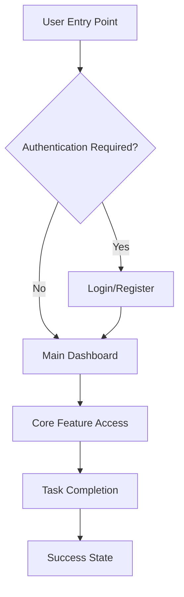
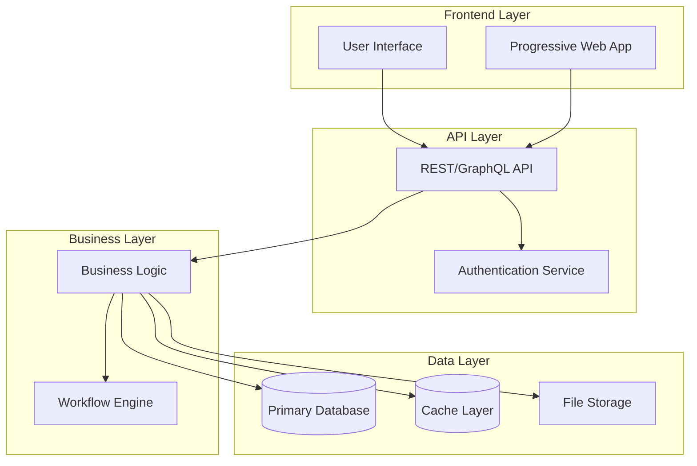
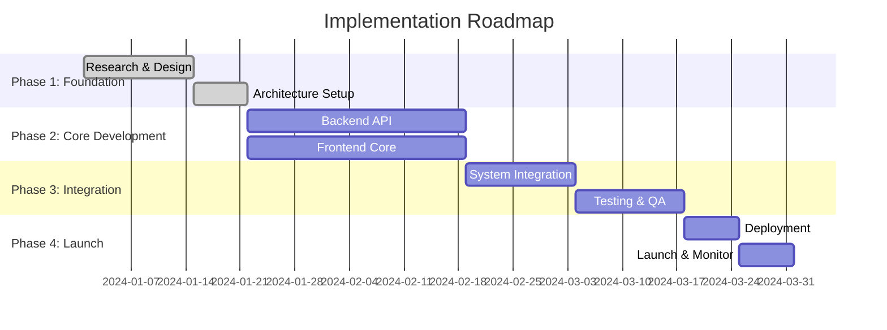

# Create Product Requirements Document

## Project: $ARGUMENTS

Generate a comprehensive PRD through deep research, hyperthinking, and strategic planning. This command works for both new projects and existing project features.

## Research & Discovery Process

### 1. Project Context Analysis
- **New Project**: Research market landscape, competitors, and technical foundations
- **Existing Project**: Analyze current codebase, architecture, and integration points
- Identify project scope, constraints, and objectives
- Define target users and use cases

### 2. Deep Research Phase
Execute comprehensive research across multiple domains:

**Market Intelligence:**
- Competitive analysis and positioning
- Market size and opportunity assessment
- User needs and pain point analysis
- Pricing models and business viability

**Technical Research:**
- Technology stack recommendations
- Architecture patterns and best practices
- Integration possibilities and constraints
- Scalability and performance requirements
- Security and compliance considerations

**User Experience Research:**
- User journey mapping and flow analysis
- Design patterns and interface standards
- Accessibility requirements
- Usability best practices

### 3. Stakeholder Validation
Ask clarifying questions to ensure complete understanding:
- Primary objectives and success criteria
- Budget and timeline constraints
- Technical preferences or restrictions
- User priorities and must-have features
- Integration requirements with existing systems

## PRD Generation Framework

Create a comprehensive PRD following this structure:

### PRD Template Structure
```markdown
# Product Requirements Document: [Project Name]

## 1. Executive Summary
- **Problem Statement**: Clear articulation of the problem being solved
- **Solution Overview**: High-level description of the proposed solution
- **Success Criteria**: Measurable outcomes that define success
- **Resource Requirements**: Timeline, budget, and team estimates

## 2. Market Analysis
- **Target Market**: Size, growth, and opportunity assessment
- **Competitive Landscape**: Key competitors and differentiation
- **User Segments**: Primary and secondary user personas
- **Value Proposition**: Unique value and competitive advantages

## 3. Product Specification
- **Core Features**: Essential functionality and capabilities
- **User Stories**: Detailed user scenarios with acceptance criteria
- **User Flows**: Step-by-step user journeys (with Mermaid diagrams)
- **Functional Requirements**: Detailed feature specifications
- **Non-Functional Requirements**: Performance, security, scalability

## 4. Technical Architecture
- **System Architecture**: High-level technical design (with Mermaid diagrams)
- **Technology Stack**: Recommended technologies and frameworks
- **Data Architecture**: Database design and data flow
- **Integration Points**: APIs and external system connections
- **Security Framework**: Authentication, authorization, and data protection

## 5. User Experience Design
- **Design Principles**: UX/UI guidelines and standards
- **Wireframes**: Key screen layouts and interactions
- **User Interface**: Design system and component library
- **Accessibility**: WCAG compliance and inclusive design

## 6. Implementation Strategy
- **Development Phases**: Logical breakdown of implementation stages
- **MVP Definition**: Minimum viable product scope and features
- **Rollout Plan**: Deployment strategy and release phases
- **Dependencies**: Prerequisites and blocking factors

## 7. Risk Assessment
- **Technical Risks**: Development challenges and mitigation strategies
- **Market Risks**: Competitive threats and market changes
- **Operational Risks**: Resource, timeline, and execution risks
- **Contingency Plans**: Alternative approaches and fallback options

## 8. Success Metrics
- **Key Performance Indicators**: Measurable business outcomes
- **User Adoption Metrics**: Usage and engagement targets
- **Technical Metrics**: Performance and reliability benchmarks
- **Business Metrics**: Revenue, growth, and ROI targets

## 9. Testing & Validation
- **Testing Strategy**: Unit, integration, and user acceptance testing
- **Quality Gates**: Validation checkpoints and success criteria
- **User Validation**: Beta testing and feedback collection
- **Performance Testing**: Load, stress, and scalability validation

## 10. Appendices
- **Glossary**: Technical terms and definitions
- **References**: Research sources and documentation
- **Assumptions**: Key assumptions and dependencies
- **Open Questions**: Items requiring further clarification
```

### Required Diagrams (Mermaid)
Include these visual elements in the PRD:

**User Flow Diagram:**


**System Architecture:**


**Implementation Timeline:**


## Hyperthinking Process

Before writing the PRD, engage in deep strategic thinking:

### Strategic Questions
- What are the second and third-order effects of this solution?
- How might this evolve over the next 2-3 years?
- What assumptions are we making that could be wrong?
- What would make this project fail, and how do we prevent that?
- How does this align with broader market trends and user needs?

### Technical Considerations
- What are the long-term maintenance implications?
- How will this scale as usage grows?
- What are the security implications and attack vectors?
- How does this integrate with existing systems and workflows?
- What are the performance bottlenecks and optimization opportunities?

### User-Centric Thinking
- What jobs are users really trying to get done?
- What are the friction points in current solutions?
- How does this improve user outcomes, not just user experience?
- What behavioral changes are we asking users to make?
- How do we measure actual user value, not just engagement?

## Output and Validation

### Save Location
Save the completed PRD as: `PRD.md` in the project root

### Quality Checklist
Before finalizing, verify:
- [ ] Problem clearly defined with user impact
- [ ] Solution addresses root cause, not just symptoms
- [ ] Technical approach is feasible and scalable
- [ ] User flows are complete and logical
- [ ] Architecture supports all requirements
- [ ] Success metrics are specific and measurable
- [ ] Risks are identified with mitigation strategies
- [ ] Implementation phases are logical and achievable
- [ ] All stakeholder questions addressed
- [ ] Ready for next phase: CLAUDE.md creation

### Next Steps
After PRD completion:
1. Review and validate with stakeholders
2. Use `/create-claude-md` to generate project-specific Claude documentation
3. Continue with `/create-planning` for detailed architecture planning
4. Finish with `/create-tasks` for implementation task breakdown

Remember: A great PRD prevents confusion, reduces rework, and sets the foundation for successful implementation.